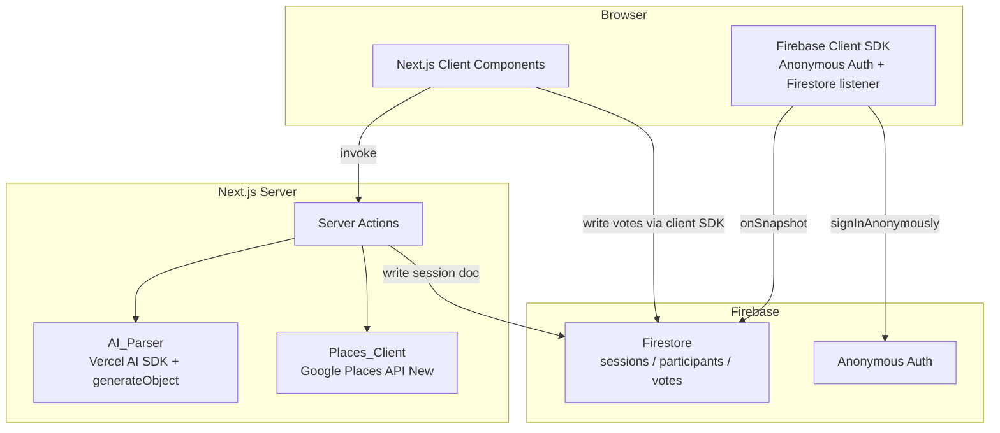
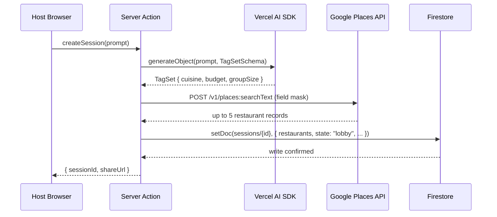
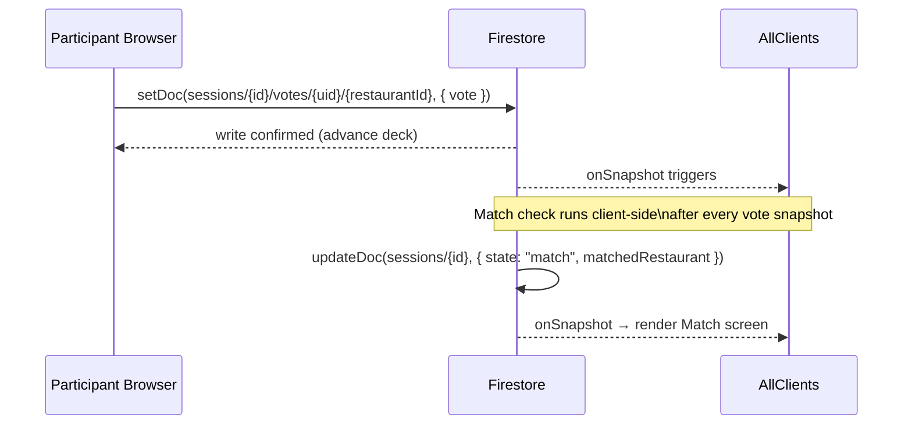

# Design Document: Restaurant Voting App

## Overview

The Restaurant Voting App is a real-time, multiplayer web application that eliminates the "where should we eat?" problem. A Host submits a natural-language prompt, the server parses it into structured search parameters, fetches five restaurants from Google Places, and generates a shareable session link. Each Participant swipes Tinder-style on restaurant cards; when every active Participant swipes right on the same restaurant, a Match screen appears with deep links to Google Maps and UberEats.

### Key Design Decisions

- **Server Actions as the API layer**: All sensitive operations (AI parsing, Places API calls) run exclusively in Next.js Server Actions, keeping API keys off the client entirely.
- **Firestore as the single source of truth**: Session state, participant roster, and votes all live in Firestore. Real-time `onSnapshot` listeners propagate state changes to all clients without polling.
- **Optimistic UI with write-gating**: Swipe animations play immediately, but the deck does not advance until the Firestore write confirms, preventing lost votes.
- **One Places API call per session**: Restaurant data is written to the Session document on creation and never re-fetched, controlling billing costs.
- **Anonymous Auth as the identity layer**: Firebase Anonymous Auth assigns each browser a stable UID with zero sign-up friction.

---

## Architecture

The system follows a thin-client / server-action pattern. The browser holds no secrets and performs no direct third-party API calls.



### Request Flow: Session Creation



### Request Flow: Real-Time Vote & Match Detection



---

## Components and Interfaces

### Page Routes (Next.js App Router)

| Route | Component | Responsibility |
|---|---|---|
| `/` | `HomePage` | Prompt input, session creation |
| `/session/[sessionId]` | `SessionPage` | Lobby, swipe deck, waiting, match, error screens |

### Client Components

#### `PromptForm`
- Renders the text input and "Find Restaurants" button.
- Validates prompt length (1–500 chars) before invoking the `createSession` Server Action.
- Displays inline validation and server error messages.

#### `AuthGate`
- Wraps the entire app; calls `signInAnonymously()` on mount.
- Renders children only after auth succeeds; shows an error state on failure.
- Exposes the current `uid` via React Context (`AuthContext`).

#### `SessionPage`
- Subscribes to `sessions/{sessionId}` via `onSnapshot` on mount.
- Derives the current screen from `session.state`:
  - `"lobby"` → `LobbyScreen`
  - `"active"` → `SwipeDeck`
  - `"waiting"` → `WaitingScreen`
  - `"match"` → `MatchScreen`
  - `"no_match"` → `NoMatchScreen`
  - `"error"` → `ErrorScreen`
- Handles participant registration (idempotent `setDoc` on join).

#### `LobbyScreen`
- Displays session name and live participant count.
- Subscribes to `sessions/{sessionId}/participants` collection for real-time count.
- Shows a loading indicator while restaurant data is being fetched.

#### `SwipeDeck`
- Renders a stacked deck of `RestaurantCard` components (active card + up to 2 peek cards).
- Manages local `currentIndex` state.
- Passes swipe callbacks down to the active card.
- Displays "X of Y remaining" progress counter.
- Transitions to `WaitingScreen` after the last card is swiped.

#### `RestaurantCard`
- Wraps a `motion.div` with `drag="x"` and `dragConstraints={{ left: 0, right: 0 }}`.
- Computes swipe direction from `dragOffset.x` relative to card width (threshold: 33%).
- On `onDragEnd`: if threshold exceeded, calls `onSwipe(direction)` and plays exit animation.
- Renders ✗ / ✓ buttons that call `onSwipe` directly (same code path as drag).
- Disables drag and buttons once a vote is recorded for this card.
- Displays restaurant name, rating, photo (with placeholder fallback), and `alt` text.

#### `MatchScreen`
- Displays matched restaurant name, photo, rating.
- "Open in Google Maps" button (disabled with tooltip if deep link unavailable).
- "Order on UberEats" button (search query deep link).
- Framer Motion entrance animation (≤1 second).
- "Start New Session" (Host) or "Go to Home" (Participant) button.

### Server Actions (`app/actions/`)

#### `createSession(prompt: string): Promise<CreateSessionResult>`
```typescript
// app/actions/session.ts
"use server"

export async function createSession(prompt: string): Promise<CreateSessionResult>
```
1. Validates prompt (non-empty, ≤500 chars) — returns validation error if invalid.
2. Calls `parsePrompt(prompt)` → `TagSet`.
3. Calls `fetchRestaurants(tagSet)` → `Restaurant[]`.
4. Writes Session document to Firestore (with retry on write failure before any re-fetch).
5. Returns `{ sessionId, shareUrl }` or an error descriptor.

#### `parsePrompt(prompt: string): Promise<TagSet>`
```typescript
// app/actions/ai-parser.ts
"use server"

export async function parsePrompt(prompt: string): Promise<TagSet>
```
- Uses `generateObject` from the Vercel AI SDK with a Zod schema enforcing `cuisine`, `budget`, and `groupSize` fields.
- Times out after 10 seconds; throws a typed `AIParserError` on timeout or model error.

#### `fetchRestaurants(tagSet: TagSet): Promise<Restaurant[]>`
```typescript
// app/actions/places-client.ts
"use server"

export async function fetchRestaurants(tagSet: TagSet): Promise<Restaurant[]>
```
- Constructs a `POST /v1/places:searchText` request with `X-Goog-FieldMask: places.id,places.displayName,places.rating,places.photos`.
- Requests exactly 5 results (`maxResultCount: 5`).
- Maps the response to the internal `Restaurant` type.
- Throws a typed `PlacesAPIError` on non-2xx responses.

### Shared Types

```typescript
// types/index.ts

type TagSet = {
  cuisine: string;
  budget: "low" | "medium" | "high";
  groupSize: number;
};

type Restaurant = {
  id: string;
  displayName: string;
  rating: number;          // 0.0–5.0
  photoReference: string | null;
};

type SessionState =
  | "lobby"
  | "active"
  | "waiting"
  | "match"
  | "no_match"
  | "error";

type Session = {
  id: string;
  hostUid: string;
  state: SessionState;
  restaurants: Restaurant[];
  matchedRestaurantId: string | null;
  createdAt: Timestamp;
};

type Participant = {
  uid: string;
  joinedAt: Timestamp;
  active: boolean;         // false if disconnected >30s
  completedAt: Timestamp | null;
};

type Vote = {
  restaurantId: string;
  uid: string;
  decision: "accept" | "reject";
  recordedAt: Timestamp;
};
```

---

## Data Models

### Firestore Collection Structure

```
sessions/                          ← root collection
  {sessionId}/                     ← Session document
    id: string
    hostUid: string
    state: SessionState
    restaurants: Restaurant[]      ← embedded array (max 5)
    matchedRestaurantId: string | null
    createdAt: Timestamp

    participants/                  ← subcollection
      {uid}/
        uid: string
        joinedAt: Timestamp
        active: boolean
        completedAt: Timestamp | null

    votes/                         ← subcollection
      {uid}/                       ← per-participant document
        {restaurantId}: "accept" | "reject"
        ← map of restaurantId → decision
```

**Design rationale:**
- Embedding `restaurants[]` in the Session document means all Participants receive the card data in a single read — no extra query needed.
- `participants/` as a subcollection allows a targeted `onSnapshot` for the lobby count without reading the full session document on every join.
- `votes/` uses one document per participant (a map of restaurantId → decision) rather than one document per vote. This keeps the match-check query simple: read all `votes/` documents and check if any `restaurantId` has `"accept"` from every active participant.

### Firestore Security Rules (outline)

```
rules_version = '2';
service cloud.firestore {
  match /databases/{database}/documents {

    // Sessions: any authenticated user can read; only server actions write
    match /sessions/{sessionId} {
      allow read: if request.auth != null;
      allow write: if false; // server-side only via Admin SDK

      // Participants: user can write their own record
      match /participants/{uid} {
        allow read: if request.auth != null;
        allow write: if request.auth.uid == uid;
      }

      // Votes: user can write their own votes
      match /votes/{uid} {
        allow read: if request.auth != null;
        allow write: if request.auth.uid == uid;
      }
    }
  }
}
```

> **Note:** Session document writes (creation, state transitions, match detection) are performed via the Firebase Admin SDK inside Server Actions, bypassing client-side rules. Client-side writes are limited to a participant's own `participants/{uid}` and `votes/{uid}` documents.

### Match Detection Logic

Match detection runs client-side inside the `onSnapshot` callback for the `votes/` subcollection. This avoids the need for a Cloud Function while keeping the logic reactive:

```typescript
function checkForMatch(
  restaurants: Restaurant[],
  votes: Record<string, Record<string, "accept" | "reject">>,
  activeParticipants: string[]
): string | null {
  for (const restaurant of restaurants) {
    const allAccepted = activeParticipants.every(
      (uid) => votes[uid]?.[restaurant.id] === "accept"
    );
    if (allAccepted) return restaurant.id;
  }
  return null;
}
```

When a match is found, the detecting client writes `{ state: "match", matchedRestaurantId }` to the Session document. Firestore's last-write-wins semantics are safe here because all clients would write the same value.

### Disconnection Handling

A Firestore `onDisconnect()` handler is registered when a Participant joins. If the client loses connectivity for more than 30 seconds (detected via the Firestore connection state listener), the participant's `active` field is set to `false`, removing them from the match condition.

---

## Correctness Properties

*A property is a characteristic or behavior that should hold true across all valid executions of a system — essentially, a formal statement about what the system should do. Properties serve as the bridge between human-readable specifications and machine-verifiable correctness guarantees.*

### Property 1: Prompt validation accepts valid inputs and rejects invalid inputs

*For any* string submitted as a prompt, the `validatePrompt` function SHALL return `valid` if and only if the string is non-empty (after trimming) and its length does not exceed 500 characters; all other strings SHALL be rejected and the AI parser SHALL NOT be called.

**Validates: Requirements 1.6**

---

### Property 2: AI parser always produces a complete TagSet for valid prompts

*For any* valid prompt string (1–500 characters), the AI parser SHALL return a TagSet object that contains non-null, non-undefined values for all three required fields: `cuisine`, `budget`, and `groupSize`.

**Validates: Requirements 1.2**

---

### Property 3: Session URL round-trip preserves session ID

*For any* session ID string, `buildShareUrl(sessionId)` SHALL return a URL string of the form `/session/{sessionId}`, and parsing that URL back SHALL recover the original session ID.

**Validates: Requirements 1.4**

---

### Property 4: Places API request invariants hold for any TagSet

*For any* TagSet passed to Places_Client, the resulting Google Places API request SHALL always include (a) the `X-Goog-FieldMask` header with exactly the value `places.id,places.displayName,places.rating,places.photos` and no additional fields, and (b) `maxResultCount` set to exactly 5.

**Validates: Requirements 4.2, 4.3, 10.1, 10.5**

---

### Property 5: Restaurant results are bounded and fully stored

*For any* Google Places API response containing between 0 and 5 restaurant records, the Places_Client SHALL return a list of length equal to the number of records returned (never more than 5), and all returned records SHALL be stored in the Session's Firestore document.

**Validates: Requirements 4.3, 4.4, 4.5, 10.5**

---

### Property 6: Restaurant data cache prevents redundant API calls

*For any* Session document that already contains a complete set of restaurant data (all required fields present for each entry), the `isCacheComplete` check SHALL return `true` and Places_Client SHALL NOT issue a new Google Places API request for that Session.

**Validates: Requirements 10.2, 10.3**

---

### Property 7: Swipe threshold bidirectionally determines vote direction

*For any* drag gesture on a RestaurantCard with a given `offsetX` and `cardWidth`, `computeSwipeDirection(offsetX, cardWidth)` SHALL return `"accept"` if `offsetX > 0.33 * cardWidth`, `"reject"` if `offsetX < -0.33 * cardWidth`, and `null` (no vote) for all offsets within the threshold range.

**Validates: Requirements 6.1, 6.2**

---

### Property 8: Vote idempotency — no duplicate votes per participant per restaurant

*For any* sequence of swipe events targeting the same (participantUid, restaurantId) pair, only the first event SHALL result in a vote being recorded in the Vote_Store; all subsequent events for the same pair SHALL be ignored and the stored vote SHALL remain unchanged.

**Validates: Requirements 6.7**

---

### Property 9: Match condition is unanimous acceptance among active participants only

*For any* combination of restaurants, vote map, and participant list, `checkForMatch` SHALL return a matched restaurant ID if and only if every participant marked `active: true` has recorded an `"accept"` vote for that restaurant; inactive participants SHALL be excluded from the evaluation, and a single active participant without an `"accept"` vote SHALL prevent a match.

**Validates: Requirements 7.3, 7.4**

---

### Property 10: Match screen deep links are constructible from restaurant data

*For any* restaurant object with a non-null `id`, `buildGoogleMapsDeepLink` SHALL return a non-null URL string. *For any* restaurant object with a non-null `displayName`, `buildUberEatsDeepLink` SHALL return a URL string that contains the URL-encoded `displayName` as the search query.

**Validates: Requirements 8.2, 8.3**

---

### Property 11: Restaurant card renders all required fields for any restaurant

*For any* `Restaurant` object, rendering `RestaurantCard` SHALL produce output that contains the restaurant's `displayName`, its `rating` formatted to one decimal place, and either the restaurant photo or a non-blank placeholder image; the photo element's `alt` attribute SHALL contain the restaurant's `displayName`.

**Validates: Requirements 5.1, 5.2, 5.3, 11.4**

---

### Property 12: Participant registration is idempotent

*For any* Participant navigating to a valid Session URL N times (N ≥ 1), the `participants` subcollection SHALL contain exactly one document for that Participant's UID regardless of how many times they navigate to the URL.

**Validates: Requirements 3.1, 3.7**

---

### Property 13: Session capacity is enforced

*For any* Session that already has exactly 10 registered active Participants, any attempt by an 11th user to join SHALL be rejected with a capacity error and the `participants` subcollection SHALL still contain exactly 10 documents.

**Validates: Requirements 3.6**

---

## Error Handling

### Error Taxonomy

| Error | Source | User-Facing Behavior |
|---|---|---|
| `ValidationError` | Client | Inline message below input; no API call made |
| `AuthError` | Firebase Auth | Full-page error with retry button; blocks all actions |
| `AIParserError` | Vercel AI SDK | Inline error on home page; prompt remains editable |
| `AIParserTimeout` | 10s deadline | Same as `AIParserError` |
| `PlacesAPIError` | Google Places | Session enters `"error"` state; Host sees retry button |
| `FirestoreWriteError` | Firestore | Retry logic (up to 3 attempts) before surfacing error |
| `SessionNotFoundError` | Firestore read | "Session not found" page |
| `SessionFullError` | Participant count | "Session is full" error page |
| `VoteWriteError` | Firestore | Error notification; deck does not advance; retry button |
| `MatchWriteError` | Firestore | Silent retry; match screen still shown locally |

### Retry Strategy

- **Firestore writes** (session creation, vote recording): exponential back-off, max 3 retries, before surfacing an error to the user.
- **AI parser**: no automatic retry — the user is shown an error and can resubmit manually.
- **Places API**: no automatic retry — the Session enters `"error"` state and the Host can trigger a manual retry via a button (which re-invokes the Server Action without creating a new Session).

### Disconnection Recovery

When a Participant's Firestore connection is restored after a disconnect, the `onSnapshot` listener automatically re-syncs. If the Session has already reached Match state during the disconnect, the Participant will see the Match screen immediately on reconnect.

---

## Testing Strategy

### Unit Tests

Unit tests cover pure functions and isolated modules:

- `validatePrompt(input)` — boundary values (empty, 500 chars, 501 chars, whitespace-only).
- `checkForMatch(restaurants, votes, activeParticipants)` — all-accept, partial-accept, empty participants, inactive exclusion.
- `buildGoogleMapsDeepLink(restaurant)` — valid input, missing id.
- `buildUberEatsDeepLink(restaurant)` — valid input, special characters in name.
- `parseTagSet(aiResponse)` — valid schema, missing fields, extra fields.
- `computeSwipeDirection(offsetX, cardWidth)` — values at, above, and below the 33% threshold.

### Property-Based Tests

Property-based tests use **fast-check** (TypeScript-native PBT library). Each test runs a minimum of **100 iterations**.

Tag format: `Feature: restaurant-voting-app, Property {N}: {property_text}`

| Property | Test Description | Generator |
|---|---|---|
| P1: Prompt validation | For any string, validate ↔ (non-empty trimmed AND length ≤ 500) | `fc.string()` with full unicode |
| P2: AI parser completeness | For any valid prompt, TagSet has cuisine, budget, groupSize | `fc.string({ minLength: 1, maxLength: 500 })` |
| P3: Session URL round-trip | For any sessionId, buildShareUrl then parse recovers sessionId | `fc.string({ minLength: 1 })` |
| P4: Places API request invariants | For any TagSet, field mask and maxResultCount are always correct | `fc.record(...)` for TagSet |
| P5: Restaurant results bounded and stored | For any API response (0–5 items), all stored, none exceed 5 | `fc.array(restaurantArb, { maxLength: 5 })` |
| P6: Cache prevents re-fetch | For any complete session doc, isCacheComplete returns true | `fc.record(...)` for Session with restaurants |
| P7: Swipe threshold bidirectional | For any (offsetX, cardWidth), direction matches ±33% rule | `fc.float()` pairs |
| P8: Vote idempotency | For any sequence of swipes on same (uid, restaurantId), only first recorded | `fc.array(swipeEventArb, { minLength: 2 })` |
| P9: Match condition with inactive exclusion | For any (restaurants, votes, participants), match ↔ all active accepted | `fc.record(...)` for vote state with active flags |
| P10: Deep links constructible | For any restaurant with id/displayName, both links are non-null and correct | `fc.record(...)` for Restaurant |
| P11: Card renders all required fields | For any Restaurant, card output contains name, rating, photo/placeholder, alt text | `fc.record(...)` for Restaurant |
| P12: Participant registration idempotent | For any N navigations to same session, participant count stays 1 | `fc.integer({ min: 1, max: 20 })` for N |
| P13: Session capacity enforced | For any session with 10 participants, 11th join is rejected | `fc.record(...)` for full session |

### Integration Tests

Integration tests use Firebase Emulator Suite (Auth + Firestore):

- Session creation end-to-end: prompt → TagSet → restaurants → Firestore document.
- Participant join: navigating to session URL registers participant exactly once.
- Real-time vote propagation: vote written by one client appears in another client's snapshot within 2 seconds.
- Match detection: all-accept scenario triggers state transition to `"match"`.
- No-match detection: all cards swiped with no unanimous accept → `"no_match"` state.
- Disconnection: participant marked inactive after simulated disconnect; match proceeds with remaining active participants.
- Session full: 11th join attempt is rejected.

### Accessibility Tests

- Automated: `axe-core` run against all page states (lobby, swipe deck, match, error).
- Manual checklist: keyboard navigation (arrow keys for swipe), visible focus indicator, screen reader announcement of match event, color contrast verification.

### End-to-End Tests (Playwright)

- Happy path: Host creates session → 2 participants join → all swipe right on same restaurant → Match screen appears with correct deep links.
- No-match path: all participants swipe left on all cards → No Match screen.
- Error path: Places API returns error → Host retries → session recovers.
